# The Footy-Tipper: A Machine Learning Approach to Winning the Pub Tipping Comp

The Footy-Tipper, an open-source Rugby League prediction engine, artfully merges R, Python, and SQL to forecast outcomes of National Rugby League (NRL) matches, creating a holistic data science product. With R for data pipelines and analysis, Python for machine learning modeling, and SQL for data management, the project is a testament to technological synergy. Central to its charm is the incorporation of Reg Reagan's iconic humor and passion, a feature brought to life by ChatGPT's advanced language models. Mimicking Reagan's distinctive style, ChatGPT crafts engaging and witty narratives for sending out predictions, blending accurate, data-driven insights with the beloved cultural fabric of Rugby League. This approach not only elevates the delivery of predictions but also pays homage to the sport's heritage, making The Footy-Tipper a unique intersection of cutting-edge technology and the nostalgia of Rugby League's golden era, as envisioned through the lens of Reg Reagan's enduring legacy.


A development blog, titled "The Footy Tipper," provides detailed insights into the progress and findings of this project. [You can read the Footy Tipper blog here on Medium!](https://medium.com/@levonrush/the-footy-tipper-a-machine-learning-approach-to-winning-the-pub-tipping-comp-dc07a7325292)

## Start Here (Recommended)

If you just want the pipeline running with minimal setup:

```bash
conda env create -f environment.yml
conda activate footy-tipper
cp secrets.env.example secrets.env
# edit secrets.env with your feed credentials

# Fresh training run from 2012
footy-tipper train --start-year 2012

# Pre-game inference
footy-tipper infer
```

Docs:
- Simple guide: `cli/README.md`
- Full command reference: `CLI.md`

## Modeling and Prediction Process (Current)

The current production model is a tiered pipeline built around explicit train/infer splits and reusable artifacts.

### Data prep and table contracts

`pipeline/data-prep.R` writes to SQLite (`data/footy-tipper-db.sqlite`) and maintains these tables:

- `footy_tipping_data`: full context table
- `training_data`: `game_state_name == "Final"` rows used for fitting
- `inference_data`: `game_state_name == "Pre Game"` rows used for prediction

### Training architecture (`footy-tipper train`)

`pipeline/train.py` now fits a stacked/calibrated scoring and win-probability pipeline:

1. Build Tier-A baseline features (team strength priors + market-aware baseline terms).
2. Train Tier-B home/away Poisson score models using curated predictors.
3. Blend Tier-A and Tier-B expected scores with learned blend weights.
4. Estimate bivariate shared-component `lambda3` for correlated score simulation.
5. Fit a logistic stacker on conditional win probabilities (Tier-A, Tier-B, market).
6. Fit a beta calibrator on stacked non-draw home-win probabilities.
7. Save all artifacts to `models/` (`home_model.pkl`, `away_model.pkl`, `stacker.pkl`, `win_prob_calibrator.pkl`, `model_manifest.json`).

### Inference architecture (`footy-tipper infer` / `footy-tipper predict`)

`pipeline/inference.py`:

1. Loads inference rows and computes Tier-A baseline on current context.
2. Loads saved artifacts and predictors from the model manifest.
3. Generates blended expected scores for home and away teams.
4. Applies stacker + calibrator to non-draw conditional home-win probability.
5. Runs bivariate simulation with `lambda3` to produce:
   - home/away/draw probabilities
   - predicted margins and scorelines
6. Upserts predictions into `predictions_table`.

### Value picks and staking (`footy-tipper send`)

`pipeline/send.py` and `pipeline/common/use_predictions/sending_functions.py`:

- Select value tips by expected value (`p * odds - 1`) per side, then keep the strongest side per match.
- Use Kelly-derived sizing with cap/fraction controls.
- Support stake modes:
  - `normalized`: stake shares sum to 100% across selected value picks.
  - `bankroll`: stake is direct fractional bankroll per pick.
- Output picks and stakes in the email/summary payloads.

### Example simulation output


## Pipeline Workflow

```mermaid
flowchart LR
  subgraph O["Orchestration + Data Prep"]
    CLI["CLI / Entrypoints<br/>footy-tipper + wrapper scripts"]
    FEEDS["Feeds + Config<br/>fixtures/ladder/performance/odds<br/>secrets.env + season controls"]
    PREP["R Data Prep<br/>pipeline/data-prep.R<br/>feature engineering + joins"]
    DB[("SQLite DB<br/>footy_tipping_data<br/>training_data (Final)<br/>inference_data (Pre Game)<br/>predictions_table")]
    CLI --> FEEDS --> PREP --> DB
  end

  subgraph M["Model Training + Inference"]
    TRAIN["Training Path<br/>load training_data<br/>compute Tier-A baseline<br/>align/prune predictors"]
    FIT["Model Fit<br/>Tier-B home/away Poisson<br/>blend with Tier-A baseline<br/>estimate lambda3<br/>fit stacker + beta calibrator"]
    ART["Model Artefacts<br/>home_model.pkl / away_model.pkl<br/>stacker.pkl<br/>win_prob_calibrator.pkl<br/>model_manifest.json"]
    INFER["Inference Path<br/>load inference_data + context<br/>Tier-A + Tier-B prediction<br/>blend/stack/calibrate<br/>bivariate simulation"]
    DB --> TRAIN
    TRAIN --> FIT --> ART --> INFER
  end

  subgraph S["Output + Delivery"]
    PRED["Prediction Output<br/>home/away/draw probabilities<br/>predicted margin + scorelines<br/>upsert predictions_table"]
    SEND["Send + Value Layer<br/>prediction_table.sql (latest season/round)<br/>EV-based value picks<br/>Kelly stake sizing (normalized/bankroll)<br/>Drive upload + OpenAI/fallback email"]
    FIT --> PRED
    INFER --> PRED
    PRED --> SEND
  end

  DB --> INFER
```



Mermaid source: `images/workflow.mmd`

The diagram reflects the current end-to-end app flow:

1. `prep` writes feature tables to SQLite.
2. `train` creates baseline/blend/stack/calibration artifacts.
3. `infer` generates probabilistic predictions and writes `predictions_table`.
4. `send` selects value picks, applies stake sizing, and handles delivery.

## Prerequisites

- For local CLI usage (recommended): Conda installed.
- For Docker usage (optional): Docker installed and running.
- Local config template: `secrets.env.example` (copy to `secrets.env` and fill in values).
- Project secrets for full send workflow:
  - `secrets.env` (feed keys are required for prep/train/infer)
  - `service-account-token.json` (only needed for Drive/Google Sheets send flows)
- Optional for development/debugging: R, Python, and an editor like VS Code.

## Secrets Setup

Create a local secrets file:

```bash
cp secrets.env.example secrets.env
```

Required in `secrets.env` for data prep:
- `PASSWORD`
- `BASE_URL`
- `NRL_FIXTURES_EXTENTION`
- `NRL_ROUND_LADDER_EXTENTION`
- `NRL_PERFORMANCE_EXTENTION`

Required for email/Drive send flows:
- `FOLDER_ID`, `FOLDER_URL`
- `MY_EMAIL`, `EMAIL_PASSWORD`
- optional `OPENAI_KEY` (fallback text is used if omitted)

Optional defaults:
- `FOOTY_TIPPER_TEST_EMAIL` for `--test` sends
- `OPENAI_MODEL`
- `FOOTY_TIPPER_EMAIL_BANNER`

## Usage

### Using the Local CLI (Recommended)

```bash
conda env create -f environment.yml
conda activate footy-tipper
footy-tipper --help
```

Common commands:

```bash
footy-tipper train --start-year 2012
footy-tipper infer
footy-tipper predict
```

### Using Docker

1. **Clone this repository.**
    ```bash
    git clone https://github.com/levonrush/footy-tipper.git
    ```

2. **Navigate to the project's directory.**
    ```bash
    cd footy-tipper
    ```

3. **Build the Docker image.** Then run either the training or prediction script explicitly.
    ```bash
    docker build -t footy-tipper .
    ```

4. **Prepare your environment file and service account token.** Ensure you have a `secrets.env` file and a `service-account-token.json` ready in your project directory but excluded from version control via `.gitignore`.

5. **Run the Docker container for training.** Replace `<your_host_port>` with the port number you want to use on your host machine (e.g., 4000). Use the `-v` option to securely mount `secrets.env` and `service-account-token.json` into the Docker container.
    ```bash
    docker run -p <your_host_port>:80 \
      -v $(pwd)/secrets.env:/footy-tipper/secrets.env \
      -v $(pwd)/service-account-token.json:/footy-tipper/service-account-token.json \
      footy-tipper python footy-tipper-train.py
    ```

6. **Run the Docker container for prediction.** Replace `<your_host_port>` with the port number you want to use on your host machine (e.g., 4000). Use the `-v` option to securely mount `secrets.env` and `service-account-token.json` into the Docker container.
    ```bash
    docker run -p <your_host_port>:80 \
      -v $(pwd)/secrets.env:/footy-tipper/secrets.env \
      -v $(pwd)/service-account-token.json:/footy-tipper/service-account-token.json \
      footy-tipper python footy-tipper-predict.py
    ```

This sequence ensures that your Docker usage is secure, efficient, and aligns with best practices for handling sensitive information. Remember to keep your `secrets.env` and any sensitive files securely managed and out of version control.

### For Development and Debugging

1. Open the project in your preferred code editor.
2. Set environment variables in `secrets.env` (recommended) or manually in your Python/R session.
3. Run `pipeline/data-prep.R` for data collection, cleaning and feature engineering.
4. For pipeline development, open and execute the `model-training.ipynb` notebook situated in the 'research' folder.
5. If Docker is used, ensure to build and run the Docker image as necessary.

### Season Configuration

- The pipeline now auto-selects season years from `FOOTY_TIPPER_START_YEAR` (default `2018`) to the current calendar year.
- Optional override: set `FOOTY_TIPPER_END_YEAR` to pin the final season year manually.
- Optional: set `FOOTY_TIPPER_INCLUDE_PERFORMANCE=false` to run without performance feed features.

Note: Ensure your Python and R environments have all necessary packages installed to run the scripts and notebooks.

### Smoke Checks

```bash
python -m compileall -q pipeline footy-tipper-train.py footy-tipper-predict.py
Rscript -e "parse(file='pipeline/data-prep.R')"
python -m unittest discover -s tests -p 'test_*.py' -v
```

## Contributing

Footy-Tipper welcomes contributions from the community. Please check the issues section of the repository to see how you can contribute.

## Contact

To obtain the project's secrets or for any questions or comments related to this project, please reach out via the repository's issues section.

## Acknowledgements
Special thanks to Seven Seas Hotel for motivating this project, Kate for telling me to make myself a portfolio piece, Victoria and Ernie for the emotional support, and ChatGPT for writing this readme.
