# Club Context: research, evidence, and shadow design

> **Status: SHADOW ONLY.** Club Context can collect reviewed events, freeze the facts available at prediction time, build candidate features, and surface an experimental Context Watch card. It does **not** alter the production probability, tip, margin, scoreline, value pick, stake, or joker decision. Two independent evaluations now find no established causal predictive value: the second, with a corrected instrument, shows the cohort effect is selection on prior underperformance rather than an effect of the event.

**Club Context** is the reader-facing name. **Psychosocial match context** is the research term: a confirmed, acute off-field event that could plausibly affect motivation, cohesion, distraction, leadership, tactics, or performance variance around a particular game.

It is not a weekly sentiment score. “The vibes are good” is not a datum, and a dramatic headline is not an effect estimate. The layer records what was verifiably known and asks leakage-safe evaluation whether narrowly defined event cohorts contain useful signal.

## Three things that are not the same

The original design collapsed three separable ideas into one prohibition. Separating them is what the v2 work is about.

| Idea | Status | Why |
| --- | --- | --- |
| **Tone mining.** Scoring the sentiment, mood, or drama of coverage. | **Still prohibited.** | Media tone is downstream of results the model already holds through elo, form, ladder and market, so it would re-encode existing features with added noise. The source policy also forbids retaining article bodies, leaving nothing to score. |
| **Direction from facts.** Which club an event happened to, and whether the source described a dismissal or a resignation. | **Permitted.** | These are entries on the public record, not readings of mood. Every `*_delta` column was already home minus away, so orientation was never actually withheld. |
| **Attention volume.** How many articles mention a club in a week. | **Permitted.** | A count carries no polarity. It is also the only context measure with prevalence high enough to matter, which the retrospective below shows is the binding constraint. |

The v1 documentation said the direction of any effect was left for a fitted model to determine from historical evidence. That was the real error, and not because direction was hidden. At 89 exposed rows in 3,180, a 300-predictor gradient-boosted model cannot determine a sign at all. The constraint was never neutrality; it was estimator capacity against sample size.



[Editable Mermaid source](diagrams/club-context.mmd)

## Why this needs a separate layer

Match, ladder, market, and lineup inputs describe most of the observable football state. They do not describe an interim coach taking charge, a confirmed club sanction, or a formal tribute match. Those events are real information, but three traps make them dangerous predictors:

1. **Story bias:** the memorable win after an event is easier to recall than the loss or ordinary performance.
2. **Regression to the mean:** an underperforming club commonly changes its coach after a bad run, when results were already likely to recover.
3. **Information leakage:** the most persuasive “they played for him” evidence is often a post-match interview published after the outcome.

The architecture therefore separates discovery, reviewed facts, prediction-time snapshots, model evaluation, and reader copy. An event can be worth mentioning without being allowed to move a probability.

## What the research says

The clearest evidence concerns head-coach changes in association football. It is useful prior evidence, not proof that the same effect transports to the NRL.

- Sousa et al.'s [2024 systematic review](https://doi.org/10.5114/biolsport.2024.131816) included 24 studies and found mixed short-term results; changing the head coach did not guarantee improved performance.
- Lundkvist et al.'s [2026 matched study of 331 mid-season dismissals](https://pubmed.ncbi.nlm.nih.gov/42421473/) compared clubs with near-identical recent performance trajectories. It found no detectable improvement in points or expected points over the following ten matches relative to controls.
- Van Ours and Van Tuijl's [14-season Dutch study](https://ideas.repec.org/a/bla/ecinqu/v54y2016i1p591-604.html) found that changed and unchanged control clubs both improved after the trigger point, consistent with regression to the mean rather than a universal “new coach bounce.”

The correct prior is therefore **no universal signed effect**. A particular transition might matter through tactics, selection, or leadership, but the system must learn that from leakage-safe NRL evidence rather than assigning an automatic boost.

### The Jai Arrow sequence

The 2026 South Sydney sequence motivated the broader question, but it is hypothesis-generating rather than causal proof. Souths lost immediately after the retirement announcement in the [24 May match](https://www.abc.net.au/news/2026-05-24/nrl-live-blog-cameron-munster-origin-training-cowboys-rabbitohs/106715988), then won 48–6 during the formal tribute match, described in the NRL's [post-match report](https://www.nrl.com/news/2026/06/12/the-ultimate-team-mate-rabbitohs-pay-tribute-to-arrow-after-emotion-charged-win/). Opponent absences, team lists, underlying form, venue, rest, and market expectations remain confounders.

Those moments are separate event phases, not one persistent “MND boost.” The post-match article may help a researcher validate that a tribute occurred; its language can never become a feature for the match it describes.

## Event taxonomy

Only acute, identifiable events enter the registry. Routine commentary, generic morale, transfer rumours, training-ground speculation, and article sentiment do not.

| Category | Included examples | Important phase distinctions |
| --- | --- | --- |
| Leadership change | Dismissal, resignation, interim appointment, planned succession, temporary leave | Announcement, effective transition, first match, resolution |
| Serious human event | Confirmed serious illness, bereavement, or comparable disruption | Announcement, ongoing period, formal return or resolution |
| Tribute, farewell, or milestone | A club-confirmed tribute match, farewell, or special appearance | Announcement and the actual match pulse are separate |
| Club crisis, sanction, or governance disruption | Confirmed sanction, insolvency-scale disruption, board or governance crisis | Announcement, effective date, ongoing phase, resolution |
| Judiciary sanction | A confirmed suspension or charge with a stated number of games | Announcement, effective period, resolution |
| Contract exit | A confirmed mid-season departure or a signed move announced during the season | Announcement, effective date |
| Ownership or governance | A confirmed change of licence, ownership, or board control | Announcement, effective date, resolution |

The last three categories were added in v2 for their prevalence: judiciary sanctions in particular happen weekly and always carry a stated number. They currently have **schema, taxonomy, discovery, and validation but no historical census**. Seeding them means real source research, and inventing history to fill a table would be worse than an empty one. That research is the open curation backlog.

Category and phase are versioned. When an event evolves, the new phase is a new registry event with its own known/effective/expiry times. It does not rewrite the old observation.

## Evidence gate

Discovery is intentionally wider than eligibility. ABC RSS and GDELT may identify candidates, but neither makes an event true. An event becomes eligible only when all of these conditions hold:

- its review status is approved;
- it is confirmed, not rumour or unconfirmed reporting;
- confidence meets the current minimum threshold;
- the taxonomy version is current;
- it was known by the applicable round decision cutoff;
- its effective window covers the match; and
- it has either an official NRL/club confirmation or two reputable, genuinely independent sources whose use is permitted.

Two syndicated copies from the same publisher or wire are one source, not two. Missing publication time, ambiguous entity mapping, unresolved rights, or a failed classifier leaves the candidate in review and out of features and reader output.

The registry stores factual summaries and links, not article bodies. See [Source and content-use policy](source-policy.md) for the rights statuses, adapter rules, and monetisation gate.

The discovery implementation uses ordinary RSS/JSON HTTP requests from Python's standard library. It requires no Chrome, headless browser, Playwright, Selenium, or local browser installation.

## Time and leakage contract

Club Context freezes one information set per round.

| Run | Decision time |
| --- | --- |
| Historical training/evaluation | `11:00 Australia/Sydney` on the local calendar day of the round's earliest fixture, shared by every match in that round |
| Live, test, refresh, or preview | One actual `decision_at_utc`, captured after ingestion and immediately before feature construction |

The distinction matters for a Thursday-to-Sunday round. News first published on Friday cannot affect Sunday's historical feature row because the whole round was frozen on Thursday morning. That conservative rule mirrors the product's weekly decision and prevents later matches receiving information the sent email did not have.

Every prediction run writes a new immutable context snapshot. A later refresh may create a newer run; it cannot update or delete the context tied to the earlier run. `known_at_utc` is the earliest supportable availability time, while `effective_from_utc` and `expires_at_utc` describe the event window. The source record also preserves whether `known_at_utc` came from a publisher timestamp, first observation, or manual verification.

Post-match reporting can validate a research label for a future audit. It can never be moved backward across the decision cutoff or presented as contemporaneous evidence.

## Persisted contracts

The Club Context tables are additive siblings of the prediction tables:

| Table | Contract |
| --- | --- |
| `context_article_snapshots` | Canonical URL, publisher, publication/first-observed times, content hash, acquisition method, extraction version, and rights status; no article body |
| `context_events` | Category, phase, known/effective/expiry times, confidence, salience, sensitivity, factual summary, confirmation, and review state |
| `context_event_sources` | Evidence role, source independence, official/reputable flags, and the article link supporting an event |
| `context_event_entities` | Team, player, coach, or club relationship and normalized team mapping |
| `context_ingestion_runs` | Mode, adapter outcomes, counts, status, and coverage diagnostics |
| `context_prediction_runs` | One immutable decision time, season/round/mode, context hash, and schema/taxonomy/feature versions |
| `prediction_context` | Immutable game-event links, observed facts, source provenance, and the exact sign-neutral feature snapshot |

Context tables never enter `prediction_table.sql`. A missing or invalid context table must leave the published tips contract intact.

## Feature design

The shared transformer is used by training, inference, and evaluation. The v1 block is frozen so the September 2026 first-pass report stays reproducible; v2 is additive.

**v1, per side plus home-minus-away difference:** category and phase counts; recency decay and games since the event; official confirmation and independent-source diversity; maximum confidence and salience; uncertainty and sensitivity indicators; explicit data-available and missing flags.

**v2 adds:**

| Family | Columns | Why it was added |
| --- | --- | --- |
| Continuous exposure | `exposure_index`, `peak_exposure`, per-category exposure | An integer count forces a tree to split on 0/1/2. Weighting each event by salience, confidence and decay gives the same information a usable gradient, which matters far more at 89 exposed rows than at 3,180. |
| Timing | `days_since_effective`, `notice_days`, `window_fraction` | A shock dismissal and a handover announced three weeks out are different events. `notice_days` is `effective_from` minus `known_at`. |
| Evidence | `evidence_strength` | Official confirmations and independent sources combined into one strength scalar. |
| Reviewed facts | `involuntary_exposure`, `voluntary_exposure`, `commemorative_exposure`, `availability_impact`, `magnitude` | Disposition is what the source said about how the event came about. See the disposition rule below. |
| Regime state | `regime_matches`, `regime_censored` | The one dense signal derivable from a sparse registry: matches played this season under the current in-season regime. |
| Attention | `attention_rate`, `attention_index`, `attention_z`, `attention_missing` | Club news volume against that club's own trailing baseline. Volume only, never tone. |

**Orientation.** `club_context_affected_side` (+1 home, -1 away, 0 neither) and `club_context_affected_exposure` name explicitly what every `*_delta` column already implied. This exists so a one-parameter estimator can pool both sides into a single coefficient instead of asking a 300-predictor model to rediscover the split from 89 rows. The sign of the effect is still fitted from held-out data; only the orientation of the fixture is asserted.

The vector still contains no generic sentiment, raw text, language-model embedding, post-match quote, or generated copy.

### Disposition rule

`disposition` is transcription, not judgement:

- `involuntary` where the source states a dismissal ("dismissed", "sacked", "ended his tenure", "no longer head coach");
- `voluntary` where it states a resignation, a stepping down, or an agreed departure;
- `commemorative` for tributes, farewells, and milestones;
- `undetermined` where the source attributes no initiative, most often "parted ways".

Applied to the audited catalogue this yields 13 involuntary, 5 voluntary, 5 commemorative, and 20 undetermined. That last number is itself a result: most reported coaching exits are written in mutual-departure language, so disposition cannot discriminate inside the leadership cohort without further research. `magnitude` is reserved for a source-stated number such as competition points stripped or games suspended. No reviewed event currently states one, so every magnitude is zero; the field is not filled with an invented severity score.

Club Context is a candidate feature family for the existing Tier-B score models and Tier-C binary classifier. It is not another stacking expert. Leadership or tribute cohorts may separately justify a bounded change to simulated residual dispersion, but only if held-out evidence shows a repeatable variance effect.

## Attention volume

Club attention is the sign-neutral, high-prevalence half of the v2 work. `pipeline/common/club_context/attention.py` reads GDELT DOC 2.0 in `timelinevolraw` mode, which returns a whole daily series per query, so a club-season costs one request rather than one per round. It stores daily counts and the size of GDELT's index that day; it fetches, stores, embeds, and scores no article text.

The weekly index is normalised twice: by the daily corpus size, so GDELT's own growth cancels, and by that club's own trailing 26-week median, so it measures unusual attention rather than how famous a club is. Both the window and its baseline end strictly before the round decision cutoff.

Coverage is honest rather than convenient. GDELT DOC indexes from 2017, so earlier seasons carry an explicit `attention_missing` flag instead of a zero, because "no coverage" and "no coverage of this club" are different facts. A refused request raises rather than storing a silent zero, since the API answers a rate limit with HTTP 200 and a plain-text refusal.

```bash
footy-tipper advanced data context attention --start-year 2017 --end-year 2026
```

**The historical series is not yet collected.** The adapter, storage, feature block, and CLI are in place and covered by offline tests, but GDELT rate-limited this host during the first backfill attempt and kept refusing afterwards, so `context_attention_series` is currently empty and every attention feature reports `attention_missing = 1`. That is the designed behaviour for absent coverage and it changes nothing downstream. Re-run the command above from a host GDELT is not throttling, at or above the documented five-second spacing (`--rate-limit-seconds`); a full 2017 to 2026 backfill is about 170 requests. Until then the attention family is untested against real data and should not be read as evidence either way.

## Two evaluators, two questions

The shipped ablation asks whether adding the feature family improves the whole model. The v2 offset asks whether the event cohort carries signal at all. They are different questions and the first cannot answer the second.

### The paired refit ablation

The production stack and a context-feature candidate are fitted on identically seeded, expanding season-out folds. With no input file, the command below generates both candidates, restricts comparison to their shared held-out rows, and then scores the pair. `--context-input` is an optional reproducibility path for rescoring an existing paired CSV/JSON file. Neither path can activate a model or modify a production artifact.

```bash
footy-tipper advanced model evaluate --context-ablation
```

The default report paths are:

- `reports/club-context-shadow-predictions-latest.csv`
- `reports/club-context-materiality-latest.json`
- `reports/club-context-materiality-latest.md`

An explicitly supplied empty paired file produces `not_ready`, not a simulated win for the feature. The nested run reports:

- log loss, Brier score, calibration, and accuracy;
- score and margin error plus residual variance when those outputs exist;
- tip flips, including flips from correct to wrong and vice versa;
- event-linked and all-game cohorts;
- category and time-since-event cohorts;
- results with and without market inputs;
- event-cluster confidence intervals with a fixed seed; and
- event-study pre-trends and placebo checks when relative-match data exists.

The underlying research set has two deliberate parts: a complete model-era census of NRL mid-season coaching changes, and a manually audited registry of identifiable serious-event, tribute, and crisis cases. Automated prospective collection measures source coverage for every category; it does not silently turn discovery hits into labels.

Market odds are a particularly important comparator because public news may already be priced. The report must state how much apparent signal disappears after odds and lineup changes are included. A feature that only repeats the market may add reader context without adding model skill.

### The cohort-restricted offset

`pipeline/common/club_context/materiality.py` holds the production baseline fixed and fits a small, pre-declared offset on the baseline logit using signed exposure. Because the design row is zero wherever no event applies, the offset is structurally zero there: every unexposed game stays byte-identical to the shipped prediction, so a reported tip flip cannot be refit noise. Estimation is leave-one-event-cluster-out, so no game contributes to the coefficient that scores it and a club's whole event window moves together.

Three specifications are declared in advance and all three are reported, which is the guard against picking a winner after seeing the fit. The primary is the simplest, a constant shift on the affected side.

The report also carries three things the refit ablation cannot produce:

- **Affected-side calibration.** The raw residual oriented to the club the event happened to, before anything is fitted.
- **A pre-event placebo.** The same clubs, oriented the same way, on their games *before* the event. Events are selected on underperformance, so if the gap is as wide before the event as after it, the layer is measuring selection rather than the event.
- **Prevalence arithmetic.** Exposure rate, the minimum detectable effect at this cluster count, and what the measured effect is worth in tips across a season. A layer can be statistically real and still not matter.

```bash
footy-tipper advanced model evaluate --context-offset
```

It reads the existing paired rows against the fixed baseline, so it needs no retrain and runs in seconds. Reports go to `reports/club-context-offset-materiality-latest.{json,md}`.

### First retrospective result — 7 September 2026 (superseded)

The audited registry contains 32 effective in-season first-grade coaching handovers from 2008–2026, plus manually reviewed serious-human, tribute/milestone, and club-crisis cases. The seeded expanding-season evaluation produced 3,180 paired held-out games from 2011–2026. Club Context was active in 89 games across 36 event clusters (2.8% of the paired sample); 81 of those games were linked to leadership changes. The other category samples are only two or three games each and cannot support category-specific conclusions.

All deltas below are context candidate minus baseline; negative log-loss, Brier, and error deltas are better.

| Cohort | Games | Δ log loss | Δ Brier | Δ accuracy | Tip flips | Δ margin MAE |
| --- | ---: | ---: | ---: | ---: | ---: | ---: |
| All held-out games | 3,180 | +0.00011 | +0.000078 | -0.25 points | 88 (40 to correct, 48 to wrong) | -0.011 points |
| Context-exposed games | 89 | -0.00725 | -0.00314 | -3.37 points | 5 (1 to correct, 4 to wrong) | -0.004 points |

The event-cluster bootstrap put the event-cohort log-loss delta's 95% interval at **-0.01911 to +0.00486**, crossing zero. Its estimated probability of improvement was 87.8%, short of the predeclared 95% evidentiary threshold. Removing market inputs produced almost the same event-cohort delta (-0.00722), so this sample does not show the apparent signal being absorbed by prices; it also does not establish an independent effect. Historical market coverage is nearly complete and the constrained stack often selected a football expert instead of a learned market blend, so this comparison should be read cautiously.

Score dispersion did not move materially: the context-to-baseline event-cohort residual-variance ratio was **1.001**. There is therefore no evidence for even a bounded simulation-dispersion adjustment.

The research-only event study tells the same cautionary story. Across 37 event matches, the affected side performed 0.77 margin points worse than its three nearest controls after orienting the nested baseline residual to that side; the event-cluster 95% interval was **-6.38 to +5.14 points**, and the permutation placebo p-value was 0.804. The raw pre-event residual was substantially negative, consistent with events—especially sackings—being selected after underperformance and with subsequent mean reversion. This is not evidence for a universal new-coach bounce.

The Jai Arrow rows illustrate why individual stories remain useful but insufficient. For the announcement-period match at North Queensland, the shadow candidate moved the Cowboys from 49.1% to 50.5% and happened to correct the tip. For the formal Souths tribute match, it moved Souths from 71.6% to 68.1% and did not change the correct Souths tip. One success and one probability reduction do not identify a stable motivational effect.

The all-game candidate can differ even on a row with no active event because adding predictors refits LightGBM and changes the learned trees. That is why the report shows both aggregate harm and the sparse event cohort, and why event-linked flips—not cherry-picked global flips—are the relevant examples.

**Decision:** retain shadow mode. The small event-cohort probability signal is uncertain, aggregate probability quality is slightly worse, tip flips skewed harmful, and neither the matched study nor dispersion test shows material benefit. Prospective collection remains worthwhile because the rare non-leadership categories are underpowered.

### Second retrospective result: the corrected instrument

Re-scored on the same 3,180 paired rows with the cohort-restricted offset. The conclusion does not change, but for a much better reason, and two of the three claims above turn out to have been artefacts of the instrument.

**The baseline really is mis-calibrated on this cohort.** Oriented to the affected club, the residual is **-16.8 percentage points**, event-cluster 95% interval **[-24.9, -8.1]** over 36 clusters. Teams in an event window land well short of the probability the model gives them.

**The pre-event placebo says it is selection, not the event.** The same clubs, oriented the same way, on their 100 games *before* the event, sat **-20.1 points** from their stated probability, interval **[-28.3, -11.7]**. The gap is if anything wider beforehand. These clubs were already losing more than the model expected; the sacking is a consequence of that, not a cause of more of it.

**The matched control agrees once it is asked properly.** The v1 study compared only the event match itself. Extending it to the following matches, where most of the exposed sample lives:

| Horizon | Matches | Mean margin-residual difference | 95% cluster interval |
| --- | ---: | ---: | --- |
| Pooled post-event | 140 | -1.15 | [-4.67, +1.68] |
| Event match | 37 | -0.77 | [-6.38, +5.14] |
| Next match | 36 | -4.76 | [-10.82, +1.62] |
| Two matches later | 34 | -4.02 | [-10.11, +2.08] |
| Three matches later | 33 | +5.34 | [-0.45, +11.17] |

Every interval crosses zero, and the sign flips at the fourth horizon. That pattern is as consistent with noise across four tested horizons as with disruption followed by reversion.

**The instrument itself was badly mis-specified.** The v1 ablation reported 88 tip flips from 89 exposed games, of which only 5 were event-linked: 83 flips were refit noise on fixtures with no event at all. The offset reports **0 unexposed rows changed** by construction. On the same event cohort the offset's point estimate is **-0.0564** log loss against the refit candidate's **-0.0073**, roughly eight times larger, though its cluster interval **[-0.1210, +0.0160]** still crosses zero at 36 clusters.

**And it would not matter anyway.** At 5.6 exposed games a season, the primary offset flips 10 tips to correct and 10 to wrong, for an accuracy delta of exactly zero and a whole-competition log-loss delta of -0.0016.

**Decision: retain shadow mode**, now on the stronger ground that the cohort effect is selection rather than causation, and that its prevalence caps its value regardless.

### What the prevalence lesson is worth

The same offset method applied to a comparator defined for every club in every round rather than 2.8% of fixtures. Season form shortfall is a club's season-to-date wins minus the model's own expected wins, both cumulative over games strictly before the one being scored.

| | Club Context | Season form shortfall |
| --- | ---: | ---: |
| Coverage | 89 of 3,180 (2.8%) | 2,388 of 3,180 (75.1%) |
| Effect | -16.8pp affected-side residual | slope 0.198, 95% cluster interval [0.091, 0.290] over 260 team-seasons |
| Out-of-sample Δ log loss | -0.0016 whole-competition | **-0.0024** whole-competition |
| Out-of-sample Δ accuracy | 0.0000 | **+0.34 points** |
| Extra correct tips per season | 0.0 | **+0.50** |

The production model systematically over-rates clubs whose season so far has fallen short of its own expectations, and under-rates those exceeding them, by about 11 points of win probability from worst to best decile. One leave-one-season-out parameter correcting it is worth roughly half a tip a season, which is five times anything Club Context can deliver and needs no new data source at all.

This is reported here because Club Context is where it was found, and because it is the answer to the question the layer was really asking. It is **measured, not activated**: it is a candidate for the calibration stage and needs its own release decision, prospective confirmation, and a check that it survives a retrain rather than merely correcting the current fit. It is scored on every `--context-offset` run so it does not go stale.

### The value guard

`FOOTY_TIPPER_CONTEXT_VALUE_GUARD` (**default `false`**) withholds value picks and stakes on a club inside an event window. It is the only place Club Context has been wired towards production, and it is deliberately not a probability change.

The reasoning is that whether the cohort effect is causal or selection, those are games where the model's stated probability has been unreliable by a wide margin, and a value pick is exactly where an unreliable probability costs money rather than a tip. Withholding a stake needs a much weaker evidentiary case than moving a published probability, because its failure mode is a missed bet rather than a wrong one.

With the flag unset every pick frame is byte-identical to the unguarded output, which a test asserts. The guard fails soft: a missing registry or unreadable database leaves picks untouched. Turning it on is a separate decision and does not ride along with a model release.

### Activation gate

The current implementation has no activation switch. A future model release may include Club Context only after a separate, explicit decision documents all of the following:

1. leakage-safe historical event-cohort improvement with uncertainty reported;
2. no material harm to overall calibration;
3. stable direction after market and lineup controls;
4. a full prospective season confirming the historical direction;
5. adequate source coverage and train/infer feature parity; and
6. completed rights review for the intended deployment, especially a monetised one.

Passing one memorable-match case, in-sample fit, or aggregate accuracy comparison is not enough.

## Explainability and the reader product

The product keeps two statements distinct:

- **Observed context:** a verified event existed, with a factual summary and source.
- **Model impact:** a fitted, measured contribution changed the prediction.

During shadow mode only the first statement is available. An eligible event may produce a sourced **Context Watch** card in the email and site, carrying the fixed disclosure that it is experimental and does not alter the displayed probability. No event, missing source data, or a context failure renders the existing no-context email/site path unchanged.

Reg remains the narrator, but prose is built only from locked facts and passes a deterministic safety layer. The layer prohibits:

- causal claims or certainty that a team is “playing for” someone;
- diagnosis speculation;
- treating illness, death, bereavement, or trauma as a betting edge;
- jokes or banter about a sensitive human event; and
- using a sensitive event to prompt banner imagery.

Validation failure falls back to deterministic factual copy. Once a future release activates the feature family, context may appear in `why_line` only when its real TreeSHAP contribution clears the normal explanation threshold. An observed event is not itself a model explanation.

## Operator workflow

```bash
# Current discovery into the review queue; fail-soft unless --strict is chosen.
footy-tipper advanced data context refresh

# Intentional import/repair of the audited historical registry.
footy-tipper advanced data context backfill

# Read-only schema, eligibility, coverage, and provenance checks.
footy-tipper advanced data context validate

# Backfill club news-volume series (volume only; GDELT indexes from 2017).
footy-tipper advanced data context attention --start-year 2017 --end-year 2026

# Generate and score paired baseline/candidate season-out rows; never activate production.
footy-tipper advanced model evaluate --context-ablation

# Score the cohort-restricted offset against the fixed baseline; no retrain needed.
footy-tipper advanced model evaluate --context-offset
```

Normal weekly prediction must survive a discovery outage, rights-disabled adapter, sparse coverage, or invalid event. Strict mode exists for diagnosing ingestion; it is not the production default.

`update-model`, advanced inference, and hosted prediction idempotently import the checked-in reviewed catalogue before discovery. This bootstraps a fresh SQLite runtime and picks up newly reviewed entries without promoting discovery headlines automatically.

## Acceptance and test invariants

The test suite protects the boundaries that matter most:

- canonical-URL deduplication, timestamps, entities, phases, confidence, and independent-source rules;
- source outage and rights-disabled adapter behavior;
- the Arrow announcement and later tribute as distinct pulses;
- post-match “played for him” reporting excluded from pre-match features;
- news after the round cutoff excluded even from a later weekend fixture;
- train/infer/evaluate feature parity and seeded reproducibility;
- test-mode non-mutation and immutable sent snapshots;
- fail-soft prediction and byte-identical no-context rendering; and
- prohibited Reg language plus deterministic safe fallback;
- additive v2 columns leaving stored v1 events eligible, with the taxonomy version held at 1;
- attention coverage recorded as missing rather than zero, and a refused request raising rather than storing a silent zero;
- news published after the decision cutoff being unable to reach an attention feature;
- the offset leaving every unexposed row byte-identical, so a reported flip is always event-linked; and
- the value guard defaulting off and reproducing the unguarded pick frame exactly.

The materiality report remains publishable even if the result is “no predictive value.” That negative is a product result: the Context Watch card can still explain the week without pretending the story earned a probability adjustment.

## Research and policy references

- E. Lundkvist et al., [“The sacking illusion: A counterfactual analysis of mid-season coaching changes using points and expected points in European football”](https://doi.org/10.1080/02640414.2026.2698238), *Journal of Sports Sciences*, 2026.
- H. Sousa et al., [“Effects of changing the head coach on soccer team's performance: A systematic review”](https://doi.org/10.5114/biolsport.2024.131816), *Biology of Sport* 41(2), 2024.
- J. C. van Ours and M. A. van Tuijl, [“In-Season Head-Coach Dismissals and the Performance of Professional Football Teams”](https://ideas.repec.org/a/bla/ecinqu/v54y2016i1p591-604.html), *Economic Inquiry* 54(1), 2016.
- [NRL Terms of Use](https://www.nrl.com/terms-of-use).
- [ABC Terms of Use](https://www.abc.net.au/conditions.htm).
- [GDELT Terms of Use](https://www.gdeltproject.org/about.html#termsofuse).
