# Architecture

Footy Tipper is a small production system wearing a tipping-comp scarf. Python owns ingestion orchestration, lineups, modelling, inference, decisions, and delivery; R reads Python-owned feed caches and builds broad feature tables; SQLite carries prepared data and operational ledgers.

[Editable Mermaid source](diagrams/current-production.mmd)

## Interfaces and ownership

| Boundary | Owner | Contract |
| --- | --- | --- |
| Human operator | `footy-tipper` 1.0 | Guided menu, status/setup, GitHub-backed tips, one-command model update, and an explicit advanced toolbox |
| Actions automation | `pipeline.ops.actions_runner` | Exact machine allowlist; unknown prediction modes fail; no training |
| Source ingestion | `pipeline/common/nrl_data/` and `pipeline/common/odds/` | Refresh nrl.com match data and market snapshots into compatible SQLite caches |
| Provider preparation | [`pipeline/data-prep.R`](../pipeline/data-prep.R) and `pipeline/common/data-prep/` | Read cached inputs and write prepared match tables |
| Lineup ingestion | [`pipeline/lineups.py`](../pipeline/lineups.py) and `pipeline/common/lineups/` | Discover, parse, version, normalize, and repair official team-list snapshots |
| Training | [`pipeline/train.py`](../pipeline/train.py) | Fit score, binary, stack, calibration, dispersion, margin, and joker artifacts into a staged release |
| Inference | [`pipeline/inference.py`](../pipeline/inference.py) | Rebuild pre-game context, load the selected release, simulate, and upsert predictions |
| Delivery | `pipeline/common/use_predictions/` | Select tips/value, size stakes, decide joker, render copy/site, send, and record state |
| Publication | `pipeline/ops/` and Google Drive | Immutable model releases + active pointer; separate mutable runtime DB/schedule/delivery state |

Human automation and cloud automation are intentionally different interfaces. The CLI can prompt, explain, and refuse. Actions must accept only exact machine arguments and return a non-zero result on ambiguity.

## Operator flow

[Editable Mermaid source](diagrams/operator-cli.mmd)

Everyday tips commands dispatch the production GitHub workflow rather than recreating it locally. Technical local compositions remain under `advanced`. Beginner commands never auto-train; production training is the explicit `update-model` transaction.

## Production inputs

The default `FOOTY_TIPPER_FEED_SOURCE=python` path uses:

- nrl.com draw JSON for fixture identity, round/state, scores, venue, and kickoff;
- nrl.com match centres for team/player statistics used to derive ladder and performance cache rows;
- Australia Sports Betting for historical odds backfill;
- Betfair Exchange for available live pre-game match, line, and totals snapshots;
- official nrl.com Team Lists and Late Mail articles for versioned lineups.

Python writes `feed_cache_fixtures`, `feed_cache_ladders`, and `feed_cache_performance` plus odds history/snapshots. Smart refresh preserves frozen seasons and last usable cache state. `FOOTY_TIPPER_FEED_SOURCE=feed` is the explicit credentialled XML rollback through the same R-facing cache boundary.

## SQLite contracts

`pipeline/data-prep.R` writes or incrementally upserts:

| Table | Role |
| --- | --- |
| `footy_tipping_data` | Full chronological match context used for feature state |
| `training_data` | Only rows where `game_state_name == "Final"` |
| `inference_data` | Only rows where `game_state_name == "Pre Game"`, scoped to the next season/round |
| `odds_snapshots` | Append-only pre-game market observations from each preparation run |

The Final/Pre Game split is a leakage boundary. The broad local training DB is preserved and backed up by `update-model`. The smaller Drive runtime DB is synchronized around Actions prediction and never pushed back over the training authority.

Lineup ingestion owns `lineup_article_snapshots`, `lineup_entries`, and `lineup_ingestion_runs`. Prediction/delivery add `predictions_table`, `email_sends`, and `joker_usage`. [`prediction_table.sql`](../pipeline/common/sql/prediction_table.sql) selects the latest season with pre-game context and its minimum round.

## Model flow and artifacts

[Editable Mermaid source](diagrams/model-stack.mmd)

A complete current release contains:

| Artifact | Purpose |
| --- | --- |
| `home_model.pkl`, `away_model.pkl` | Tier-B score models |
| `model_manifest.json` | predictor layout, blend/Tier-A settings, dispersion, uncertainty, margin, and compatibility metadata |
| `binary_model.pkl` | Tier-C direct winner classifier |
| `stacker.pkl` | regularized signal combiner |
| `win_prob_calibrator.pkl` | beta probability calibrator |
| `joker_policy.json` | backtested joker policy summary |
| `training-receipt.json` | release provenance, versions, training scope, artifact sizes, and hashes; written last |

Home, away, manifest, and a valid receipt are the minimum publication boundary for a 1.0 release. Compatibility logic may load older optional omissions only during explicit migration/verification.

Training is local-authoritative with a default 100-candidate Bayesian search. Candidate fits parallelize across the operator's cores while each LightGBM fit stays single-threaded. Artifacts are staged outside the active local set, technically validated, uploaded under a create-only release ID, then downloaded and hash-checked. `update-model` dispatches `model-check.yml`; GitHub Actions loads the exact candidate using the production image. Only a successful workflow may move `model-current.json`. No local Docker runtime is required.

Actions resolves the pointer and exact release; it never trains. Its runtime push can update only the DB and schedule, so an in-flight old runner cannot overwrite models or reverse a new activation.

## Lineups and as-of state

[Editable Mermaid source](diagrams/lineup-as-of.mmd)

Training selects the latest eligible snapshot at or before the configured cutoff, normally 24 hours before kickoff. Inference selects the most recent known pre-game snapshot. Both paths derive the same versioned feature families and fill safe defaults when coverage is absent. See [Lineup integration](lineup-integration.md).

## Prediction, delivery, and state

Inference combines the active model release with current prepared rows and upserts `predictions_table`. Delivery derives:

- primary tip and calibrated probability;
- expected-value opportunities from offered odds;
- Kelly-derived stake fractions;
- joker recommendation and competition strategy advice;
- Claude-generated or deterministic copy;
- an optional OpenAI-generated banner.

Scheduled and human-triggered live sends share one serialized GitHub Actions workflow. It first validates the sender credentials, token, Google Sheet access, and frozen recipient envelope, then claims a season/round marker in Drive immediately before SMTP. This external marker protects the gap between successful email delivery and a later DB/runtime push. A pending marker is deliberately treated as uncertain and blocks automatic resend; an ambiguous or partially refused SMTP result leaves it pending. Full success reconciles the marker with `email_sends` and applies an eligible joker transition. Test mode sends one recipient but mutates none of those production stores.

The gate polls every 15 minutes and opens at 11:00 `Australia/Sydney` on the first-game day, subject to GitHub scheduling delay and the post-kickoff grace window.

[Editable Mermaid source](diagrams/operations-state.mmd)

## Production feed and rollback

[Editable Mermaid source](diagrams/feed-migration.mmd)

The Python nrl.com/odds path cut over on `main` in PR #34. R deliberately keeps the same cache boundary. Dashed paths in the diagram mark XML rollback and optional future features, not an unfinished production cutover. See [Data-source migration](data-source-migration.md).

## Failure boundaries

- No pre-game rows: clean no-op; no old-round email.
- Lineup ingestion: continue with safe defaults unless strict diagnosis was requested.
- Performance data enabled but unavailable: fail preparation/training clearly.
- Optional Claude/OpenAI missing: deterministic copy or static presentation fallback.
- Drive unavailable in a stateful cloud run: fail rather than claim unpersisted success.
- Required active model missing/invalid: fail; never hosted auto-train or legacy-archive guess.
- Model update failure before activation: previous release remains active.
- Live delivery ambiguity: preserve the pending (uncertain) state and block retry.
