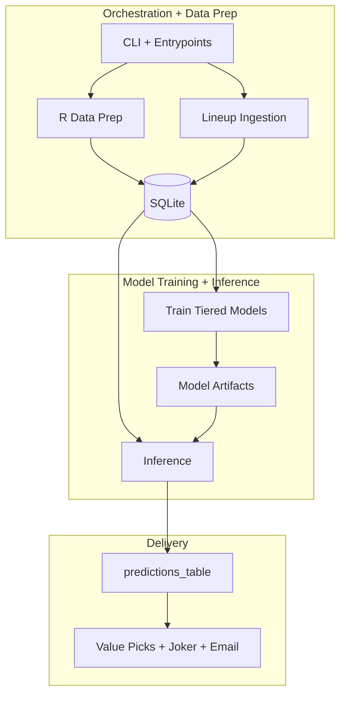

# How It Works

This page explains the end-to-end pipeline and the data contracts that keep it stable.

## High-Level Flow

Mermaid source file: `images/workflow.mmd`

## Data Prep (`pipeline/data-prep.R`)

Data prep writes these tables in `data/footy-tipper-db.sqlite`:
- `footy_tipping_data`: full context table
- `training_data`: `game_state_name == "Final"`
- `inference_data`: `game_state_name == "Pre Game"`

This split is a core safety feature. It prevents accidental train/infer leakage.

## Lineup Ingestion (`pipeline/lineups.py`)

Lineup ingestion writes additional SQLite tables:
- `lineup_article_snapshots`: article-level versioned metadata and parse status
- `lineup_entries`: normalized team/player/jersey/role rows
- `lineup_ingestion_runs`: recent/backfill run history used for auto-bootstrap decisions

These tables are refreshed before `prep/train/infer/predict` unless `--skip-lineups` is set.
`train` can also trigger a one-time historical backfill bootstrap before the normal recent refresh.
The model pipeline remains fail-safe: missing lineup data does not block train/infer.

## Training (`pipeline/train.py`)

Training currently does this:
1. Build Tier-A baseline features.
2. Merge lineup-aware features (availability, spine/bench/continuity/freshness deltas).
3. Train Tier-B home/away Poisson score models.
4. Blend Tier-A and Tier-B score expectations.
5. Estimate shared score covariance (`lambda3`) for bivariate simulation.
6. Build uncertainty-marginalized Tier-B conditional win probabilities (Monte Carlo using lineup uncertainty).
7. Fit win-probability stacker + beta calibrator.
8. Save model artifacts to `models/`.
9. Run joker backtest simulations and save `models/joker_policy.json`.

Main artifacts:
- `models/home_model.pkl`
- `models/away_model.pkl`
- `models/stacker.pkl`
- `models/win_prob_calibrator.pkl`
- `models/model_manifest.json`
- `models/joker_policy.json`

## Inference (`pipeline/inference.py`)

Inference:
1. Loads `inference_data`.
2. Rebuilds Tier-A context.
3. Merges lineup-aware features using latest lineup snapshots.
4. Loads manifest + trained artifacts.
5. Produces blended expected scores.
6. Applies uncertainty-marginalized Tier-B conditional probabilities before stack + calibration.
7. Simulates outcomes/scorelines with bivariate Poisson.
8. Upserts into `predictions_table`.

## Send Layer (`pipeline/send.py`)

Send does three decisions:
- winner/probability communication
- value picks and stake sizing
- joker recommendation for the current round

Outputs can be uploaded to Drive and sent via email list/test email.

## Why This Architecture

- R handles data wrangling and feature engineering where your pipeline already has history.
- Python handles model fitting/inference/artifact lifecycle.
- SQLite gives a transparent, debuggable state store.
- Each phase is runnable independently but still works as one weekly pipeline.
