# Models, markets, and evaluation

The model is an ensemble because NRL games are not obliged to be convenient. One component remembers team strength, one models scores, one models the winner directly, the market contributes its own information, and a calibrated meta-layer settles the argument.


[Editable Mermaid source](diagrams/model-stack.mmd)

## Tier A: dynamic baseline

Tier A builds sequential team state from matches available before each game. Its tuned alpha/carryover settings provide expected home and away scores plus a conditional home-win probability. It is deliberately stable when richer features are sparse, especially early in a season.

It is not a full Bayesian attack/defence hierarchy. The research case for that model remains exploratory; calling the current baseline Bayesian would be borrowing a dinner jacket.

## Tier B: home and away score models

Separate tuned Poisson pipelines predict expected home and away scores from fixture, ladder, recent performance, and lineup-derived predictors. Training creates out-of-fold (OOF) score means so blend and meta-model fitting are not judged only on in-sample predictions.

Learned weights blend Tier A and Tier B score means separately by side. These means generate a conditional home-win signal after marginalizing over lineup-selection uncertainty with deterministic per-game Monte Carlo draws.

## Tier C: direct winner model

Tier C is a binary classifier trained on non-draw outcomes with the same selected predictor frame. Its OOF probabilities enter stacker training; the final `binary_model.pkl` supplies the inference signal. This gives the ensemble a direct classification view alongside score-derived probabilities.

If the binary artifact is absent in an older compatible model bundle, inference can continue without it.

## Markets stay separate

Head-to-head prices are de-vigged to a conditional market probability. Line inputs add the implied spread, line overround, cover signal, and model-versus-market disagreement. These signals enter the meta-layer; they are not buried inside Tier-B score predictors.

That separation makes the ensemble interpretable and avoids feeding the bookmaker into a score model, then counting the bookmaker again in the stacker. The full rationale and bibliography are in [Principled odds integration](principled-odds-integration.md).



[Editable Mermaid source](diagrams/odds-before-after.mmd)

## Stacking and calibration

The regularized logistic stacker combines:

- Tier-A conditional probability
- OOF Tier-B conditional probability
- OOF Tier-C probability
- market conditional probability and an odds-missing indicator
- Tier/market disagreement terms
- line-market features

The regularization strength is selected by cross-validation from a defined grid. When enough season groups exist, the beta calibrator is fitted to leave-one-season-out (LOSO) stacker predictions, so it does not calibrate the same meta-model rows used to fit the deployed stacker. With fewer than three season groups it falls back to the explicitly logged in-sample stack output.

At inference, missing stacker or calibrator artifacts degrade to Tier B or uncalibrated stack output for compatibility. Current training writes both artifacts.

## Margin and coherent scorelines

Winner probability and expected margin are related but not identical decisions:

- a small ridge blend uses OOF model margin, bookmaker spread, and Tier-A margin when enough honest line rows exist;
- games without a usable line fall back to the simulated margin;
- output margin and scoreline are reweighted to agree with the calibrated winner probability, and the margin sign is clamped to the selected tip.

Score simulation uses a bivariate Poisson shared component `lambda3`. When OOF residuals support valid overdispersion estimates, gamma-mixed Poisson draws supply a negative-binomial fallback per side; otherwise the ordinary Poisson path remains. Deterministic game-specific seeds prevent a rerun from flipping a tip through random-number drift.

## Artifacts

| File | Contents |
| --- | --- |
| `home_model.pkl`, `away_model.pkl` | Tier-B score pipelines |
| `binary_model.pkl` | Tier-C classifier |
| `stacker.pkl` | version-aware logistic meta-model |
| `win_prob_calibrator.pkl` | beta calibrator |
| `model_manifest.json` | predictor schema, blend weights, Tier-A config, `lambda3`, dispersion, uncertainty, margin metadata |
| `joker_policy.json` | historical joker-policy backtest summary |

## Honest evaluation

Use:

```bash
footy-tipper evaluate --skip-prep --seasons 3
```

The evaluator holds out each recent season in turn and fits blend weights, stacker, and calibrator only on earlier seasons. It also reports calibration, tipping, market comparison, score/margin behavior, ROI simulations, and competition-policy evidence where coverage allows. Reports are written under `reports/`.

The checked-in [`reports/eval-latest.json`](../reports/eval-latest.json) records the current 2024–2026 nested holdout summary: 552 pooled non-draw games, 63.4% tipping accuracy, 0.6413 log loss, and 61.2% market-favourite accuracy on covered games. The competition simulation reported about a 35.0% win probability in its configured field scenario. These are historical evaluation results, not a promise about the next round.

Training-time metrics remain useful diagnostics, but the meta-layer has seen the season's OOF rows; do not substitute them for the nested evaluation.

## Decisions downstream

The calibrated prediction becomes:

- a tip and confidence statement;
- expected value `p * decimal_odds - 1` on either side;
- Kelly-derived staking, bounded by configured minimums and maximums;
- a points or competition-win joker recommendation;
- advisory or automatic competition strategy, depending on configuration.

See [Competition strategy](comp-strategy.md) and [Joker strategy](joker-strategy.md) for the stateful decision contracts.

## Limitations

- Historical odds and line coverage are incomplete and time-varying.
- Pre-game market snapshots can be stale relative to kickoff.
- Player identities and old team-list layouts are noisier than match-level IDs.
- A score model cannot fully represent rugby league's discrete scoring and tactical state; dispersion and shared components only soften the assumption.
- `lambda3` may estimate near zero when the evidence does not support a shared component.
- A competition-win policy depends on field size, points gap, opponent behavior, and joker rules; it is scenario-dependent.
- The nrl.com/odds feed replacement is on the runtime path, but source coverage and markup remain operational dependencies; the legacy XML feed is the rollback.

For the research lineage and what has not shipped, see [Research and history](research-and-history.md).
