# Operations, reliability, and safety

This is the runbook for what owns state, what happens on a rerun, and how the automated path fails without turning one missing provider into a small constitutional crisis.



[Editable Mermaid source](diagrams/operations-state.mmd)

## State ownership

| State | Owner | Write rule |
| --- | --- | --- |
| Code and hand-written docs | Git | Human-reviewed commits |
| `data/footy-tipper-db.sqlite` | Local run / Drive `state/` | R prep, inference, and operational ledgers |
| `models/` | Local training / Drive `state/` | Publish only after successful training and validation |
| `schedule.json` | State scheduler / Drive `state/` | Derived from next unsent round |
| `docs/site/` | Site generator / GitHub Pages branch path | Generated; publish explicitly or from Actions |
| Email delivery | SMTP | One live `(competition_year, round_id)` unless forced |

`footy-tipper state pull` restores the published DB and models before either local training or cloud prediction. Model downloads are staged and validated before replacing the local last-known-good set. `state push` refuses an incomplete home/away/manifest artifact set, then uploads a consistent DB snapshot, models, and derived schedule. The stateful prediction job uses concurrency group `footy-tipper-state` with cancellation disabled.

## Prediction and send idempotency

- `predictions_table` is keyed/upserted by `game_id`; rerunning inference replaces the game's prediction rather than duplicating it.
- [`prediction_table.sql`](../pipeline/common/sql/prediction_table.sql) selects the latest year with pre-game rows and the minimum round in that year.
- `email_sends` prevents a second live email for the same season/round.
- `--force-resend` bypasses only that email guard and must be an explicit operator decision.
- `joker_usage` is written only after a successful live send whose recommendation is `PLAY`.
- `odds_snapshots` is append-only by preparation run; repeated observations are evidence, not duplicates.
- Lineup content hashes deduplicate identical article versions and repair old zero-entry snapshots in place.

## GitHub Actions

[The repository Actions dashboard](https://github.com/levonrush/footy-tipper/actions) is the live scheduler.

| Workflow | Trigger | Contract |
| --- | --- | --- |
| `predict.yml` | Every 15 minutes; manual `test`, `live`, or `refresh` | Run a small Drive-backed gate, then pull state, predict with `--skip-auto-train`, push state, and attempt site publication for non-skip modes. |
| `build-image.yml` | Relevant runtime-file changes on `main`; manual | Build/push `ghcr.io/levonrush/footy-tipper:latest` and SHA tag. |
| `smoke-checks.yml` | Push and pull request | Python compile/lint/tests plus R source parsing; no publication. |

The scheduled prediction gate reads Drive `schedule.json` and chooses:

- `send`: from 11:00 `Australia/Sydney` on the local calendar day of the next unsent round's first game until twelve hours after kickoff;
- `refresh`: when the schedule is more than eight days old;
- `skip`: otherwise.

A green gate-only run may mean `skip`; inspect whether the `predict` job ran. The 15-minute poll means the first eligible run is normally the first poll at or after 11:00 Sydney; `zoneinfo` handles AEST/AEDT and UTC date boundaries. The twelve-hour post-kickoff grace window supplies retries while `email_sends` prevents duplicates. An expired unsent round is skipped in favour of the next actionable round. Workflows never self-enable, so an operator pause remains authoritative until `gh workflow enable predict.yml` is run explicitly.

Manual dispatches:

```bash
gh workflow run predict.yml -f mode=test
gh workflow run predict.yml -f mode=refresh
gh workflow run predict.yml -f mode=live
gh run watch
```

`test` is the default manual mode and does not write the production send ledger. `refresh` runs `predict --skip-send`. `live` sends to the real list. All three modes include `--skip-auto-train`; a missing published model fails the job instead of starting a hosted retrain.

## Actions secrets

GitHub Actions materializes:

- `SECRETS_ENV`: the complete contents of local `secrets.env`;
- `SERVICE_ACCOUNT_JSON`: the complete service-account JSON;
- `GITHUB_TOKEN`: GitHub's short-lived automatic token for checkout, package access, and site pushes.

The workflow masks each environment value before subsequent steps. Because workflow logs are public with the repository, do not use `--dry-run` in Actions: it prints the rendered email. Rotate secrets through repository settings or `gh secret set`; never commit the materialized files.

## Optional integrations and failure behavior

| Condition | Expected behavior |
| --- | --- |
| No pre-game rows | Inference writes an empty batch; send exits cleanly. |
| Missing/sparse lineups | Log and fill safe defaults; strict mode alone fails hard. |
| Missing lineup feature merge | Continue by default; `FOOTY_TIPPER_LINEUP_FEATURES_STRICT=true` makes it fatal. |
| Missing performance data while enabled | Fail fast with a clear provider/configuration error. |
| Missing Claude/Anthropic | Use deterministic email copy when generation cannot run. |
| Missing OpenAI/banner generation | Continue with the normal/static presentation. |
| Missing Google dependencies or credentials | Skip Drive-dependent actions with a clear message where the command permits; cloud production should treat an unexpected skip as an alert. |
| Missing required models locally | Standalone `infer`/`predict` auto-train unless `--skip-auto-train` is set. |
| Missing required models in Actions | Fail clearly because every cloud prediction passes `--skip-auto-train`; publish a complete local model set. |

Claude writes copy. OpenAI generates an optional banner. They are independent failure boundaries.

## Local model publication runbook

Run this from the repository root in the `footy-tipper` Conda environment:

```bash
conda activate footy-tipper

# Prevent Drive-state races during the long local run.
gh workflow disable predict.yml
# Wait until both commands list no runs, then disable once more.
gh run list --workflow predict.yml --status queued
gh run list --workflow predict.yml --status in_progress
gh workflow disable predict.yml
gh api 'repos/{owner}/{repo}/actions/workflows/predict.yml' --jq .state

footy-tipper state pull
FOOTY_TIPPER_TUNE_ITER=100 footy-tipper train

# Validate that the new artifacts load without allowing another train.
footy-tipper infer \
  --skip-prep \
  --skip-lineups \
  --skip-nrl-data \
  --skip-auto-train

footy-tipper state schedule
footy-tipper state push

gh workflow enable predict.yml
gh workflow run predict.yml -f mode=refresh
```

After disabling the workflow, wait for both queued and in-progress runs to drain (`gh run watch <run-id>`), disable it again, and confirm the API reports `disabled_manually` before pulling. This second disable is especially important on the first cutover run because an older in-flight gate may have started before self-enabling was removed. The 100-candidate value is the normal local default and is shown explicitly so an old shell override cannot silently reduce the search. Bayesian candidates run in parallel across the machine; individual LightGBM fits use one thread. Inspect the validation inference and printed schedule before publication. The push must find loadable `home_model.pkl` and `away_model.pkl` artifacts plus a valid `model_manifest.json`; optional current artifacts should travel with them.

If training or validation fails, do **not** run `state push`. Re-enable `predict.yml`; Drive keeps the previous good models. The manual `refresh` is for a successful publication only and updates cloud data/state without emailing anybody.

The scheduled `predict` path performs only recent ingestion, inference, and distribution. It never enters a historical training bootstrap because `--skip-auto-train` is mandatory in Actions.

## Recovery runbooks

### A live run fails before email

Fix the provider/configuration issue and rerun. No `email_sends` row or joker transition should have been written.

### Email succeeded but a later step failed

Check `email_sends` before doing anything. Rerun without `--force-resend`; the ledger should prevent a duplicate email while allowing diagnosis of remaining local/state tasks. Use explicit state/site commands where possible.

### Local training or validation fails

Do not publish partial output. Re-enable `predict.yml`; Drive retains the last successful artifact set. A later `state pull` restores those models because staged downloads do not replace them until archive validation passes.

### State is missing on a new installation

Create the local DB/models through prep/train, validate them, then seed once with `footy-tipper state push`. The command rejects missing required artifacts, but still verify the intended DB and optional model set before replacing a known-good remote.

### Lineup coverage collapses

Run recent ingestion with strict mode to expose the failure, inspect parse statuses, then backfill only if historical repair is needed. Do not make the entire prediction path strict as a permanent workaround.

## Backups and Pages

After a successful production send, a consistent gzipped DB snapshot can be uploaded under Drive `backups/`; the newest eight are retained. Set `FOOTY_TIPPER_DB_BACKUP=false` to disable it.

`footy-tipper site` builds locally. `site --publish` commits and pushes generated `docs/site/`, so it changes external Git state. Configure Pages to deploy `main` `/docs`, and set `FOOTY_TIPPER_SITE_URL` for email links.

The expected endpoint is [the Footy Tipper GitHub Pages site](https://levonrush.github.io/footy-tipper/site/). As of the documentation review on 2026-07-13 it returned 404; describe it as expected/unpublished until a live fetch succeeds.

## Diagnostic checklist

- Gate decision and reason in Actions logs
- local training/validation result and Drive model publication timestamp
- latest season/round chosen by `prediction_table.sql`
- row counts in `inference_data` and `predictions_table`
- lineup run status, zero-entry rate, and eligible as-of coverage
- head-to-head and line-market coverage
- required/optional artifact files and manifest predictor schema
- `email_sends`, `joker_usage`, and `comp_strategy_decisions`
- Drive state timestamps and backup presence
- Pages configuration and `docs/site/` commit

## Security

Never commit `secrets.env`, `service-account-token.json`, passwords, API keys, or rendered logs containing them. Preserve [`.gitignore`](../.gitignore), review public Actions output, and use the least credentials required for each workflow.
