# Independent delivery watchdog

Footy Tipper uses two hosted clocks:

- GitHub polls at off-boundary Sydney times from 11:07 through 14:37.
- Google Apps Script checks every five minutes and requests the same guarded
  gate once per 30-minute recovery slot, beginning around 11:27 and continuing
  through approximately 14:57.

The Apps Script never predicts or sends email. It can only dispatch
`predict.yml` with `watchdog=true`; the workflow reads the Drive-backed
schedule and chooses `live`, `refresh`, or `skip`. The normal concurrency lock,
Drive marker, SQLite ledger, odds checks, and SMTP rules remain authoritative.



[Editable Mermaid source](diagrams/delivery-watchdog.mmd)

## Production deployment

The Google watchdog was installed and verified on **7 August 2026**:

- the repository variable is `FOOTY_TIPPER_WATCHDOG_ACTOR=levonrush`;
- `installWatchdog` validated the restricted token and created exactly one
  five-minute `watchdogTick` trigger;
- the guarded installation probe returned `skip`, with prediction, delivery,
  runtime push, and site publication all skipped;
- the first independent automatic heartbeat also returned `skip` and left
  round 24 unsent with no unresolved delivery marker;
- implementation shipped in [PR #41](https://github.com/levonrush/footy-tipper/pull/41)
  and the pinned `clasp` deployment commands were corrected in
  [PR #42](https://github.com/levonrush/footy-tipper/pull/42).

The verified automatic heartbeat is
[Actions run 31140048581](https://github.com/levonrush/footy-tipper/actions/runs/31140048581).
Normal weekly operation requires no manual command. Act only on an Apps Script
failure notification, an open `automation-alert` issue, or a credential
exposure/revocation.

## One-time setup or full rebuild

The repository owner must perform only the secret-handling and Google consent
steps. Never paste the token into chat, a terminal command, source code, or a
GitHub issue.

### 1. Create the restricted GitHub token

Open the
[prefilled fine-grained token form](https://github.com/settings/personal-access-tokens/new?name=Footy-Tipper-Watchdog&description=Dispatches+the+guarded+prediction+gate+from+Google+Apps+Script&target_name=levonrush&expires_in=none&actions=write).

Confirm:

- resource owner: `levonrush`;
- expiration: no expiration;
- repository access: **Only select repositories** → `footy-tipper`;
- repository permissions: **Actions: Read and write**;
- no account or organization permissions.

Generate the token and keep it in the clipboard only until it has been stored
in Apps Script.

### 2. Create and upload the Apps Script project

From the repository:

```bash
cd watchdog
npm ci --ignore-scripts
npm run login
npm run create
npm run push
npm run open
```

`npm run login` opens Google's OAuth approval page. The generated
`watchdog/.clasp.json` contains the non-secret script ID and is ignored by Git.
The project manifest fixes the runtime timezone to `Australia/Sydney`.

In the opened Apps Script project:

1. Open **Project Settings**.
2. Under **Script Properties**, add `GITHUB_TOKEN`.
3. Paste the token as its value and save it.

No SMTP, Drive, recipient, model, or email credential belongs in Apps Script.

### 3. Authorize and install the trigger

First confirm the production gate is safe to probe:

```bash
footy-tipper advanced cloud gate
```

It must report `skip`. Then, in the Apps Script editor, select
`installWatchdog` and click **Run**. Approve the requested external-request and
trigger permissions.

`installWatchdog` validates that the token belongs to `levonrush`, verifies
`predict.yml`, submits one guarded probe, replaces only existing
`watchdogTick` triggers, and creates a five-minute clock. It is safe to run
again.

The probe run must be named `Predict watchdog gate`, show actor `levonrush`,
and stop after the gate. It must not run prediction, send email, create a
delivery marker, change the ledger, push runtime state, or publish the site.

Configure the non-secret actor guard once:

```bash
gh variable set FOOTY_TIPPER_WATCHDOG_ACTOR \
  --repo levonrush/footy-tipper \
  --body levonrush
```

Set this variable before running `installWatchdog`.

## Verification

In Apps Script:

- **Triggers** must show exactly one `watchdogTick` time-driven trigger;
- **Executions** must show the successful manual `installWatchdog` execution;
- `watchdogStatus` may be run at any time and returns only non-secret state.

In the repository:

```bash
gh run list --repo levonrush/footy-tipper \
  --workflow predict.yml --event workflow_dispatch --limit 5
footy-tipper status --json
```

The next round must remain unsent after the skip probe, with no unresolved
delivery marker. Verify the next scheduled Apps Script heartbeat during the
Sydney recovery window before considering the fallback fully operational.

## Scheduling and retries

The Google trigger wakes every five minutes. The script explicitly converts
the instant to `Australia/Sydney`, so AEST/AEDT and a travelling user's local
timezone do not affect the recovery window.

Eight 30-minute slots begin at 11:22, 11:52, 12:22, 12:52, 13:22, 13:52,
14:22, and 14:52. A successful slot is stored as
`LAST_SUCCESSFUL_SLOT`; overlapping or restarted executions cannot dispatch it
again. A failed dispatch is not recorded and may retry at the next five-minute
tick.

Network failures and HTTP 408, 409, 429, and 5xx responses are retried with
short backoff. Permanent failures contain only the HTTP status. The token and
GitHub response body are never logged. Google sends the script owner a failure
notification when an installed trigger continues to fail.

## Failure and recovery

An automated GitHub gate or prediction failure creates or updates one assigned
issue labelled `automation-alert`. The next successful live run closes it.

The issue is evidence and an action queue, not a resend control. Do not close it
to force a green state; fix the linked failure and let a successful live run
reconcile it.

Always begin delivery recovery with:

```bash
footy-tipper status
```

A `pending` Drive marker means SMTP may have delivered partially. It blocks
both clocks and must be reconciled from SMTP evidence; never delete it or force
an automatic resend.

If the token is revoked or exposed:

1. Create a replacement with the same repository and permission restrictions.
2. Replace only the `GITHUB_TOKEN` Script Property.
3. Confirm the gate reports `skip`, then run `probeWatchdog`.
4. Revoke the old token in GitHub.

## Rollback

Disable the Google clock first by running `uninstallWatchdog` or deleting the
`watchdogTick` trigger in Apps Script. GitHub's Sydney-time schedule continues
independently and delivery state is unchanged.

After the trigger is gone, revoke the fine-grained token, delete the
`GITHUB_TOKEN` Script Property, and remove
`FOOTY_TIPPER_WATCHDOG_ACTOR` from GitHub.
